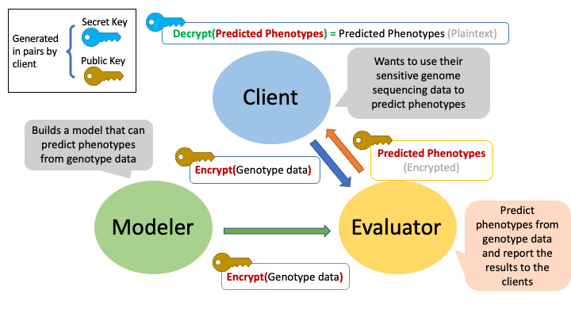

# HEPRS

Here we introduce an application of Fully Homomorphic Encryption (FHE) for secure and private computation of Polygenic Risk Scores (PRS) in genomic studies. Illustrated with the schizophrenia risk prediction, our work employs FHE to perform computations on encrypted genotype data, preserving the privacy and security of sensitive genetic information. Utilizing the CKKs protocol within the Lattigo library, this approach maintains the confidentiality of both genomic data and PRS models within a three-party system involving clients, modelers, and evaluators. 



The client can be an individual or healthcare provider who possesses private genomic data and seeks to obtain PRS calculated based on an individual's genome. The modeler can represent a research institute or a centralized data repository, who builds PRS models off population datasets, which are also sensitive. The evaluator provides the computation power to handle the PRS calculation over large datasets or models. In this scenario, both the client and modeler do not trust the evaluator to handle the genomic data or model directly, which is where our FHE method comes in. The client would first generate a pair a keys, the public and secret keys, for encryption and decryption respectively, and only the public key will be shared by the modeler and evaluator. The client and modeler will each encrypt their data using the public key and then send the encrypted data to the evaluator. The evaluator will therefore perform calculations directly on encrypted data, without need or capability to decrypt the genomes or the model. Encrypted results will then be returned to the client in the encrypted form, which can only be decrypted by the client with the secret key. We note that, in this scenario, the modeler does need to trust the evaluator not to share the model with the client though. In this way, only the client will be able to access the plaintext PRS results.

**Encryption Method**

Encryption of the model and inputs is performed using Lattigo, a Go module that implements Ring-Learning-With-Errors-based homomorphic-encryption primitives and Multiparty-Homomorphic-Encryption-based secure protocols. For our task, we use the Full-RNS Homomorphic Encryption for Arithmetic for Approximate Numbers (HEAAN, a.k.a. CKKS) scheme. For more information about the package, please consult https://github.com/tuneinsight/lattigo/tree/master.

**Security level**

With this method, at least a 128-bit security is maintained. We implement our method with the PN13QP218 parameter choice. This includes a ring dimension of 4,096 and logQP equal to 109. Parameters for higher security levels are also available. See Usage section below.

## Usage

To showcase the applicability of our method, the `main.go` contains all 4 steps of the process: input encryption, model encryption, encrypted calculation, and output decryption. To run the program, use the command

`go run main.go -pq <genotypes.csv> <betas.csv> <yourphenotype> <NumberIterations> <Moduli> <NumberIndividual>`

Arguments:

`<genotypes.csv>`: Replace this parameter with a csv file containing the genotype information, with each row representing an individual and each column representing an SNP. Genotypes are encoded in binary format (0/1).

`<betas.csv>`: Replace this parameter with your PRS model parameters, i.e. GWAS-derived beta values for each SNP in the model. The number of beta values should be consistent with the number of SNPs in `genotypes.csv`. If your model also has an intercept, please manually add an intercept column to your `<genotypes.csv>` file.

`<yourphenotype>`: Name of your phenotype.

`<NumberIterations>`: You can run the program for multiple iterations to evaluate the stochasticity. Use 1 for most cases.

<Moduli>: The modulus parameter (N) influences both security and performance of the FHE method. Increasing the value of N enhances security but reduces performance. To simplify usage, we currently restrict N to the following options: $2^{12}, 2^{13}, 2^{14}, 2^{15}$, and $2^{16}$. (When running the command, use integers $0, 1, 2, 3, 4$ for $2^{12}, 2^{13}, 2^{14}, 2^{15}, 2^{16}$.) Other FHE parameters are automatically set based on the Lattigo defaults. Users can adjust the balance between security and computational cost by selecting an appropriate value for N and using the `-pq` option for Lattigo parameters that achieve post-quantum security. 

`<NumberIndividual>`: Number of individuals included in your `<genotypes.csv>` file.

Additional Options:

`-h, --help`: Show help message

`-pq`: Use post-quantum parameters from the Lattigo package defaults.

`-print`: Print time and memory usage. This option will also save time and memory usage of each step into csv files.

## Example

In the `/example_data` directory, we provide a small synthetic dataset generated by hapgen2 (https://mathgen.stats.ox.ac.uk/genetics_software/hapgen/hapgen2.html), which includes genotypes of 10k SNPs for 50 individuals (`genotype_10kSNP_50individual.csv`). The phenotype is simulated using heritability $h^2 = 0.3$ (`phenotype0_true_10kSNP_50individual.csv`). We created a PRS model using Ridge regression (`beta_10kSNP_phenotype0.csv`). The predicted phenotypes from our PRS model (without encryption) are also provided for reference (`phenotype0_pred_10kSNP_50individual.csv`).

To run HEPRS on this example dataset, use:

```
go run main.go example_data/genotype_10kSNP_50individual.csv example_data/beta_10kSNP_phenotype0.csv phenotype0 1 0 50 -pq
```

The above command does the following:

* Encrypts the genotype matrix.
* Encrypts the PRS model (betas for each SNP).
* Calculates PRS using fully homomorphic encryption.
* Decrypts the output and saves as a plaintext csv file.

This process is expected to take just a few seconds on a personal laptop.

A directory named with the moduli and iteration will be generated (e.g. PN13QP218_dir_0), which includes the encrypted genomic data, encrypted model, encrypted model output and decrypted (plaintext) PRS results.

## For more information

The preprint related to this work is available on biorxiv: https://www.biorxiv.org/content/10.1101/2024.05.26.595961v1

If you have additional questions, please contact elizabeth.knight@yale.edu and jiaqi.li@yale.edu 
